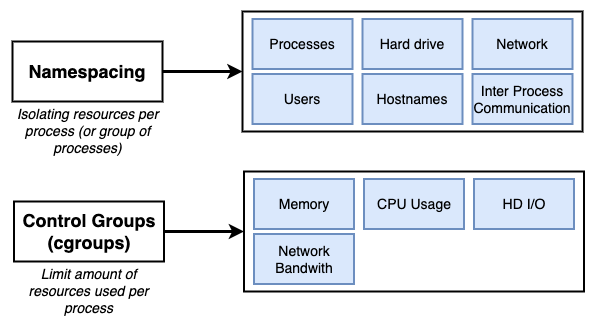
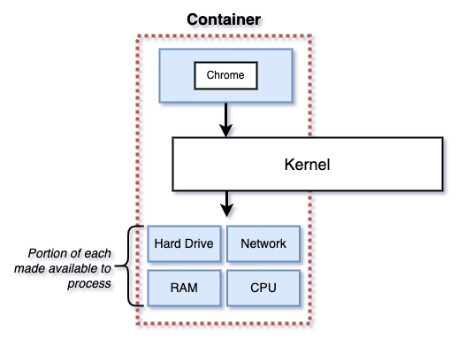
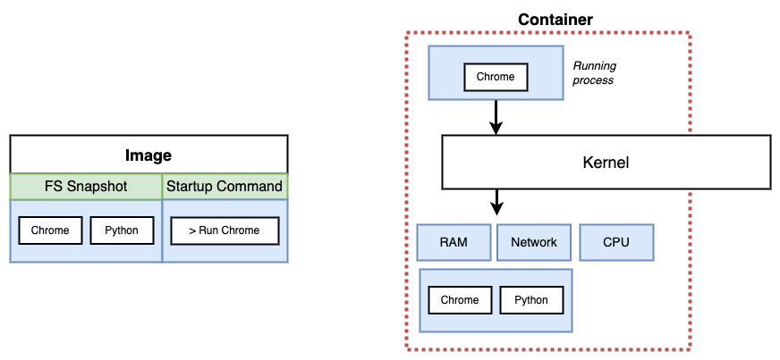
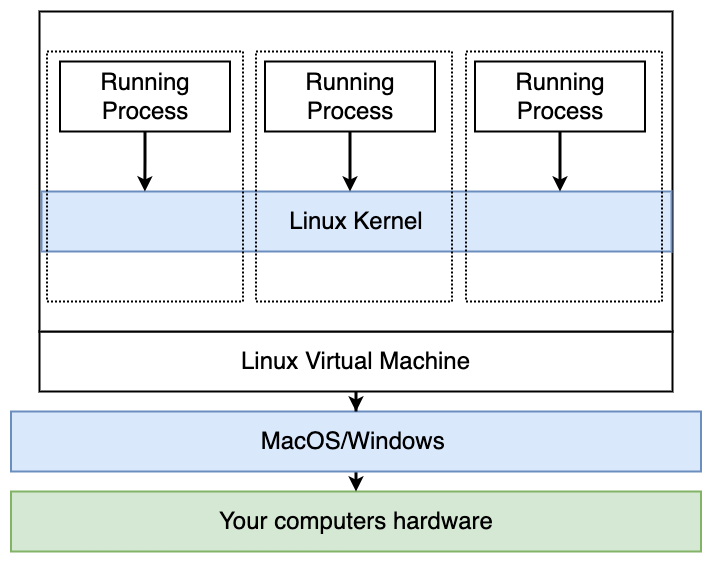

# Introduction

## Namespacing and control groups in linux


## Containers
Container boundaries are not physical


## Image to container mapping
Image a snapshot of a file system and starup command


## Docker stack
Namespacing and control groups are feature of linux, docker on mac or windows runs on a top of linux vm and all the containers will be created on this vm

`docker version`
```
Server:
 Engine:
  Version:          20.10.20
  API version:      1.41 (minimum version 1.12)
  Go version:       go1.18.7
  Git commit:       03df974ae9e6c219862907efdd76ec2e77ec930b
  Built:            Wed Oct 19 02:58:31 2022
  OS/Arch:          linux/amd64
  Experimental:     false
```
