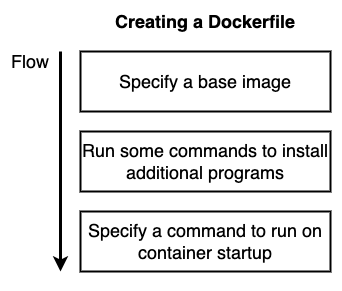
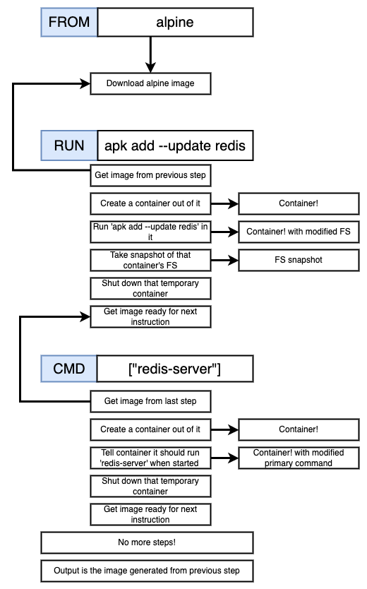

# Introduction

## Namespacing and control groups in linux


## Containers
Container boundaries are not physical


## Image to container mapping
Image contains a snapshot of a file system and startup command


## Docker stack
Name spacing and control groups are feature of linux, docker on mac or windows runs on a top of linux vm and all the containers will be created on this vm

`docker version`
```
Server:
 Engine:
  Version:          20.10.20
  API version:      1.41 (minimum version 1.12)
  Go version:       go1.18.7
  Git commit:       03df974ae9e6c219862907efdd76ec2e77ec930b
  Built:            Wed Oct 19 02:58:31 2022
  OS/Arch:          linux/amd64
  Experimental:     false
```


# Manipulating containers with the docker client

## Creating and running a docker container

Runs a default command when container starts up `docker run <image-name>`

Overriding default start up command `docker run <image-name> <optional: command>`

example:

```
mohammadsoaib@Mohammads-MacBook-Pro ~ % docker run busybox echo hi there
hi there
```
```
mohammadsoaib@Mohammads-MacBook-Pro ~ % docker run busybox ls
bin
dev
etc
home
lib
lib64
proc
root
sys
tmp
usr
var
```

List all running containers `docker ps`

List all container ever created `docker ps --all`

`docker run <image-name>` = `docker create <image-name>` + `docker start <container-id>`

Creating a container: copy a file system snapshot from image

Staring a container: executing a startup command

```
mohammadsoaib@Mohammads-MacBook-Pro ~ % docker create hello-world
f545065be36ed4c10040e4c12006b78c4d0cacb06972e7e406ea1f5cb0d3d07b
mohammadsoaib@Mohammads-MacBook-Pro ~ % docker start f545065be36ed
f545065be36ed
```

adding **-a** flag says 'watch for output from container and print it out to terminal'
`docker run` by default logs output coming out of container but `docker start` does not

```
mohammadsoaib@Mohammads-MacBook-Pro ~ % docker create hello-world 
62c0eb7d6fea28dc8919ca742f274053e0d9647a56601a286f34ed55e81b90e9
mohammadsoaib@Mohammads-MacBook-Pro ~ % docker start -a 62c0eb7d6fea28

Hello from Docker!
This message shows that your installation appears to be working correctly.

To generate this message, Docker took the following steps:
 1. The Docker client contacted the Docker daemon.
 2. The Docker daemon pulled the "hello-world" image from the Docker Hub.
    (amd64)
 3. The Docker daemon created a new container from that image which runs the
    executable that produces the output you are currently reading.
 4. The Docker daemon streamed that output to the Docker client, which sent it
    to your terminal.

To try something more ambitious, you can run an Ubuntu container with:
 $ docker run -it ubuntu bash

Share images, automate workflows, and more with a free Docker ID:
 https://hub.docker.com/

For more examples and ideas, visit:
 https://docs.docker.com/get-started/

mohammadsoaib@Mohammads-MacBook-Pro ~ % 
```

Restarting stopped container: `docker start -a <container-id>`

**Once container is created default startup command can't be changed**

Removing stopped container `docker system prune`

Retrieving logs outputs: `docker logs <container-id>`

```
mohammadsoaib@Mohammads-MacBook-Pro ~ % docker create busybox echo Hi there!
00ef815ad1395b6e15165482a1381c18fa7dbb14c4ba2c4a91995e0eb10d1e46
mohammadsoaib@Mohammads-MacBook-Pro ~ % docker start 00ef815ad13
00ef815ad13
mohammadsoaib@Mohammads-MacBook-Pro ~ % docker logs 00ef815ad13
Hi there!
```

Stopping a docker container: `docker stop <container-id>` issues *SIGTERM* command, if the container does not stops within 10s of stop command it will fall back to docker kill command

Killing a docker container: `docker kill <container-id>` issues *SIGKILL* command

Executing commands in running containers: `docker exec -it <container-id> <command>`

Linux processes have three communication channels *STDIN, STDOUT & STDERR*, `-i` flag is used to link our terminal to *STDIN* channel to new running process, `-t` is majorly formats the text in terminal, `-it` = `-i -t`


Getting command prompt in a container `docker exec -it <container-id> sh`

Starting container with command prompt `docker run -it <image-name> sh`

# Building custom images through docker server



```
# Use an existing docker image as a base
FROM alpine

# Download and install dependency
RUN apk add --update redis

# Tell the image what to do when it starts as a container
CMD [ "redis-server" ]
```

Building a docker image from Dockerfile `docker build <build-context>`

eg: `docker build .`

Building a docker image with tag `docker build -t <docker-hub-id>/<name-of-image-to-create>:<version> .`

eg: `docker build -t soaib024/redis:latest .`

Running a container created out of image from docker-hub `docker run soaib024/redis`

At each step of build process new intermediate temporary container is created out of image from previous image till final image is created - intermediate image are cached for build time optimization 



Creating image out of running container `docker commit -c 'CMD ["cmd1"]' <container-id>`

```
mohammadsoaib@Mohammads-MacBook-Pro ~ % docker run -it alpine sh
Unable to find image 'alpine:latest' locally
latest: Pulling from library/alpine
f56be85fc22e: Already exists 
Digest: sha256:124c7d2707904eea7431fffe91522a01e5a861a624ee31d03372cc1d138a3126
Status: Downloaded newer image for alpine:latest


/ # apk add --update redis
fetch https://dl-cdn.alpinelinux.org/alpine/v3.17/main/x86_64/APKINDEX.tar.gz
fetch https://dl-cdn.alpinelinux.org/alpine/v3.17/community/x86_64/APKINDEX.tar.gz
(1/1) Installing redis (7.0.11-r0)
Executing redis-7.0.11-r0.pre-install
Executing redis-7.0.11-r0.post-install
Executing busybox-1.35.0-r29.trigger
OK: 10 MiB in 16 packages
/ # 
```
```
mohammadsoaib@Mohammads-MacBook-Pro ~ % docker ps
CONTAINER ID   IMAGE            COMMAND          CREATED          STATUS          PORTS     NAMES
d8a024260789   alpine           "sh"             54 seconds ago   Up 51 seconds             ecstatic_joliot
30082fbf4e57   soaib024/redis   "redis-server"   10 minutes ago   Up 10 minutes             xenodochial_shaw


mohammadsoaib@Mohammads-MacBook-Pro ~ % docker commit -c 'CMD ["redis-server"]' d8a024260789
sha256:105b2f334ae940877f50e71f5c30d9416124199c05aecab9336d88521c5d0104


mohammadsoaib@Mohammads-MacBook-Pro ~ % docker run 105b2f334ae9408
```
